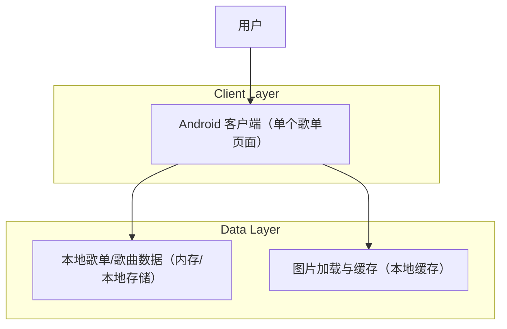

## 1.Architecture design

## 2.Technology Description
- Frontend: Android 原生（Java）+ XML Layout + RecyclerView（列表渲染）
- Backend: None（本次改版不引入服务端能力）

## 3.Route definitions
| Route | Purpose |
|-------|---------|
| /playlist/{playlistId} | 单个歌单页面：展示歌单封面（取列表第一首并随列表变化）、展示歌曲列表（左侧为歌曲封面缩略图）、移除页面内播放控制区 |

## 4.API definitions (If it includes backend services)
- None

## 6.Data model(if applicable)
- None（本次仅 UI/展示逻辑改版，不新增数据表）

## Implementation Notes（落地要点）
1. 头部歌单封面来源
   - 规则：封面 = 当前歌曲列表第 1 项的封面；若列表为空或第 1 项无封面，则显示默认歌单封面。
   - 触发刷新：列表首次加载、增删歌曲、拖拽排序（或任何导致“第一项变化”的操作）后，重新计算并刷新头部封面视图。

2. 移除页面内播放控制区
   - 删除/隐藏上一首、播放/暂停、下一首、进度条、播放顺序等控件及其占位容器。
   - 调整布局：将原控制区占用的高度全部让渡给 RecyclerView 列表区域。

3. 列表项改版
   - 左侧区域从“序号文本”改为“歌曲封面缩略图”。
   - 增加 item 高度（并同步调整封面缩略图尺寸与对齐方式），保证标题/副标题（若存在）视觉层级清晰。

4. 兼容性与性能
   - 列表封面全部走图片缓存策略，避免快速滑动时频繁解码/加载导致卡顿。
   - 对空封面、加载失败提供统一兜底图与占位图。